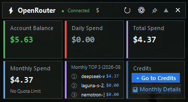
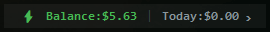
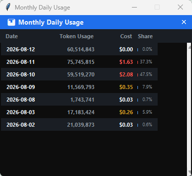
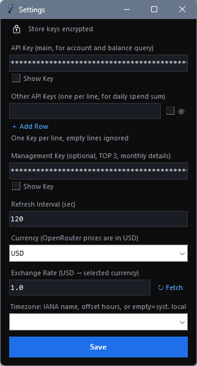

# OpenRouter Dashboard

A Windows desktop dashboard built with `tkinter` for monitoring OpenRouter usage and spend.

## Features

- Real-time monitoring of OpenRouter API usage and credits
- Compact "Dynamic Island" style UI that can expand to show detailed statistics
- Automatic refresh of data at configurable intervals
- System tray-like behavior (minimizes to a small capsule when not expanded)
- Position persistence and edge snapping for window placement
- Currency toggle between USD, CNY, EUR, GBP, JPY, and more (with automatic exchange rate fetching)
- Support for multiple API keys (aggregated usage) and optional management key for detailed analytics
- API keys encrypted in config.json using machine-specific encryption (toggleable in Settings)
- Right-click context menu for settings, refresh, pinning, and exit
- Configurable refresh rate, window transparency, and timezone

## Installation

1. **Prerequisites**
   - Python 3.9 or higher
   - Windows operating system

2. **Install Dependencies**
   ```bash
   pip install -r requirements.txt
   ```

3. **Configuration**
   - Copy `config.example.json` to `config.json`
   - Edit `config.json` to add your OpenRouter API key(s) and adjust settings as needed
   - The app will look for `config.json` in the same directory as the executable or script

## Usage

### Running the Application

```bash
python main.py
```

On Windows you can also double-click `run.vbs` for a no-console launch (requires Python on `PATH` and dependencies already installed via `pip install -r requirements.txt`).

### Configuration Options

The `config.json` file supports the following fields:

| Field | Type | Description |
|-------|------|-------------|
| `api_key` | string | Primary OpenRouter API key (required) |
| `refresh_sec` | number | Refresh interval in seconds (default: 60) |
| `x`, `y` | number | Window position (saved automatically) |
| `alpha` | number | Window transparency (0.0-1.0, default: 0.93) |
| `timezone` | string | IANA timezone for displaying times (empty = system local) |
| `extra_keys` | array | Additional API keys to aggregate usage for |
| `mgmt_key` | string | Optional management key for monthly model TOP 3 and daily breakdown |
| `pinned` | boolean | Whether window stays on top (default: false) |
| `currency` | string | Display currency code (default: "USD"). Supported: USD, CNY, EUR, GBP, JPY, CAD, AUD, CHF, INR, KRW, BRL, RUB, TRY, ZAR, SGD, HKD, TWD, MYR, THB, IDR |
| `currency_rate` | number | Exchange rate from USD to selected currency (default: 1.0). Can be fetched automatically via the "↻ Fetch" button in Settings |
| `last_currency` | string | Last non-USD currency chosen in Settings (used by the title-bar USD ↔ alternate toggle; set automatically) |
| `island_state` | string | UI state: "island" (collapsed) or "expanded" (default: "island") |
| `encrypt_keys` | boolean | Whether to encrypt API keys in config.json (default: true). Toggle in Settings with lock button |

### UI Interaction

- **Left-click and drag**: Move the window (snaps to screen edges)
- **Right-click**: Open context menu with options:
  - Pin/Unpin: Keep window always on top
  - Settings: Open configuration dialog
  - Refresh: Manually trigger data update
  - Exit: Close the application
- **Double-click**: Toggle between island (collapsed) and expanded states
- **Currency toggle**: Click the currency symbol in the title bar to switch between USD and the last non-USD currency selected in Settings

## Building the Executable

To create a standalone Windows executable using PyInstaller:

```bash
pip install pyinstaller
pyinstaller --onefile --windowed --name OpenRouter-Dashboard main.py
```

The executable will be generated in the `dist` folder.

## How It Works

- The application uses the OpenRouter API to fetch:
  - Authentication information (`/auth/key`)
  - Credit balance (`/credits`)
  - Recent activity (`/activity`)
- Data is refreshed automatically in a background thread to avoid blocking the UI
- Usage statistics are calculated for daily and monthly periods
- When an `mgmt_key` is provided, additional endpoints are used for:
  - Monthly model usage top 3
  - Daily breakdown by model

## Notes

- API keys are stored locally in `config.json` - treat this file as sensitive
- The application does not collect or transmit any personal data
- For security, consider using API keys with limited permissions if concerned
- The UI is designed to be minimal and non-intrusive, following macOS Dynamic Island principles

## Troubleshooting

- **Application won't start**: Ensure Python 3.9+ is installed and dependencies are met
- **No data showing**: Verify your API key is valid and has sufficient permissions
- **Window not appearing**: Check if the window is positioned off-screen (delete config.json to reset)
- **High CPU usage**: Increase the refresh interval in config.json

## License

This project is open source and available under the [MIT License](LICENSE).

## Acknowledgments

- Built with [tkinter](https://docs.python.org/3/library/tkinter.html)
- Uses the [OpenRouter API](https://openrouter.ai/)
- Inspired by macOS Dynamic Island feature
- by Claude Sonnet 4.6 & Gemini3.5 Flash
A Windows desktop floating window for monitoring OpenRouter usage.


## Features

- **Dynamic Island Mode**: Normally collapsed as top capsule, click to expand full dashboard
- **Real-time Usage**: Shows daily/monthly token usage and spend
- **Quota Progress Bar**: Visual display of monthly quota usage percentage
- **Daily Popup**: Click date card to view last 30 days daily usage + mini bar chart
- **Multi-Key Support**: Add multiple API Keys in settings, aggregate total usage
- **Multi-currency**: Display costs in any supported currency (USD, CNY, EUR, GBP, JPY, and more) at a configurable exchange rate
- **Edge Snap**: Drag window near screen edge to auto-snap
- **Transparency / Always on Top**: Right-click menu to adjust transparency and pin
- **Windows 11 Native Rounded Corners and Shadows**

## Screenshots

| **Dashboard**  | **Settings** |
|---------|---------|
Expanded <br>  <br> Capsule <br>  <br> Monthly Details Popup <br>   |  


## Quick Start

### Method 1: Run Python Directly

```bash
# Install dependencies
pip install requests

# Run
python main.py
```

### Method 2: Use Packaged exe

Run `OpenRouter-Dashboard.exe` directly (no Python installation needed).

## Configuration

After first run, select **Settings** from right-click menu to enter API Key, or edit `config.json` directly:

```json
{
  "api_key": "sk-or-v1-yourkey",
  "refresh_sec": 60,
  "alpha": 0.93,
  "pinned": true,
  "timezone": "",
  "currency": "USD",
  "currency_rate": 1.0,
  "extra_keys": [],
  "mgmt_key": ""
}
```

| Field | Description |
|------|-------------|
| `api_key` | OpenRouter API Key (required) |
| `refresh_sec` | Auto-refresh interval (seconds), default 60 |
| `alpha` | Window transparency, 0.1 ~ 1.0 |
| `pinned` | Whether to stay on top |
| `timezone` | Display timezone: IANA name (e.g. `Asia/Shanghai`, `Europe/Berlin`), numeric offset in hours (e.g. `8`, `-3.5`), or empty for system local (default). On Python 3.9/3.10 on Windows, install `tzdata` for IANA name support; numeric offsets always work. |
| `currency` | Display currency code (default: `"USD"`) |
| `currency_rate` | Exchange rate from USD to the selected currency (default: `1.0`) |
| `last_currency` | Last non-USD currency from Settings (used by the title-bar toggle; set automatically) |
| `extra_keys` | Additional API Key list (for multi-account aggregation) |
| `mgmt_key` | Optional management key for monthly model TOP 3 and daily breakdown |

Full field list (including `island_state`, `encrypt_keys`, etc.): see **Configuration Options** above.

## Usage

| Action | Effect |
|------|--------|
| Click window | Toggle capsule / expanded state |
| Drag window | Move position, auto-snap on release |
| Right-click menu | Settings / Refresh / Transparency / Pin / Exit |
| Click date card | Popup daily usage details |
| Click currency symbol | Toggle USD ↔ last non-USD currency from Settings |

## Package as exe

```bash
pip install pyinstaller
pyinstaller --onefile --windowed --name OpenRouter-Dashboard main.py
```

